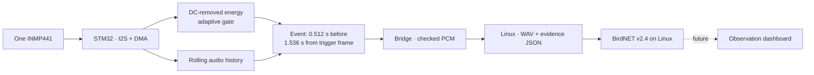

# Sylva EchoLens
### Listen first. Keep the moment. Understand it locally.

Current documentation snapshot: **September 14, 2026**. Start with the
[capability and verification ledger](docs/CURRENT_STATUS.md) for the concise state
of implemented, host-tested, device-tested and planned work.

Sylva EchoLens is an edge AI wildlife acoustic observer built around Arduino
UNO Q and Arduino App Lab. Its purpose is to document animal vocalizations in
the field, with local processing and traceable evidence for each observation.

**Current hardware: one INMP441 microphone.** The STM32 listens, estimates the
ambient noise floor, and selects acoustic events. Linux receives verified audio
windows. The Linux application integrates offline BirdNET v2.4 classification. An
announced assiolo replay produced two audited `Otus scops` results at 0.996 and
0.997; controlled provenance and negative-control evaluation remain the milestone.

## Why recognition belongs on the device

**Keep observing, even when there is nowhere to upload.** The lightweight version
being developed uses one microphone, no camera and no servos, with very low energy
consumption as a design target. Local recognition is intended to support extended
operation without Internet: retain observations and audio while storage permits,
then prioritize compact recognition records when the audio budget is exhausted.

The offline writer now enforces separate audio, record and system-space reserves,
can evict only its own unprotected WAVs, and falls back to temporary-audio inference
with a durable recognition record. This behavior is host-tested and has passed an
isolated device smoke test; controlled power-cut and endurance tests remain. Power
consumption and autonomy still require physical measurements. An experimental
suspend-to-idle path entered the kernel power state, but acoustic UART wake did not
pass physical-device acceptance. It is disabled by default and excluded from the
release; Linux remains awake in the supported configuration.
See [offline operation](docs/OFFLINE_OPERATION.md) for behavior, limits and evidence
requirements, including the fact that recognition records also need finite storage.

## The observation trail

The gate detects acoustic activity, not species. Wind, speech and machinery may
also trigger it. BirdNET supplies ranked species candidates; a confidence threshold
keeps weak candidates as `unknown` instead of presenting them as detections.

## What exists today

| Capability | Status |
|---|---|
| Mono INMP441 capture through custom SAI1/DMA loader | Device-tested in the August 30 bring-up |
| Consistent signed PCM through MCU, transport and WAV | Host-tested and independently checked on 3 device events |
| Background estimation, adaptive threshold and hysteresis | Host-tested; physical-board state transitions observed |
| Fixed 2.048-second event with 0.512-second pre-event history | Host-tested; 3 device WAVs audited |
| Event checksum, SHA-256, metadata, no fabricated missing samples | Host-tested; device transfer verified |
| Offline BirdNET v2.4 adapter on the Qualcomm MPU | Device-tested, including networkless inference and two audited assiolo-replay results at 0.996/0.997 |
| Audio quota, protected retention, recognition-only fallback and restart reconciliation | Device smoke-tested in isolated storage; power-cut/endurance testing pending |
| Live wildlife dashboard and threshold configuration | Planned; no wildlife UI is implemented yet |
| Stereo direction finding, camera and pan/tilt | Future; requires additional hardware |
| Linux suspend-to-idle with STM32 event wake | Experimental and disabled; acoustic UART wake failed device acceptance |
| Measured battery/solar autonomy | Not established; requires whole-board measurements |

See [validation](docs/VALIDATION.md) for the exact boundary between source-level,
host and device evidence. Earlier nonzero recordings alone do not establish
species-recognition quality or calibrated acoustic sensitivity.

## Start here

This is the project repository:
[AM275-pilot/SylvaEchoLens](https://github.com/AM275-pilot/SylvaEchoLens).

1. Follow [the beginner project guide](docs/PROJECT_DOCUMENTATION.md): it collects
   the story, complete BOM, schematic, build path and evidence plan in one place.
2. Check [the hardware map](docs/HARDWARE.md): use the existing single-microphone wiring.
3. Read [the runbook](docs/RUNBOOK.md): the custom loader is required.
4. Run the [host tests](docs/VALIDATION.md).
5. Build the active sketch using `scripts/build-audio-gate.ps1`.
6. Follow the runbook to deploy the matching Python receiver and sketch.
7. Keep startup representative during calibration, then inspect event WAV/JSON pairs.

**Use only the guarded build and deployment scripts in this repository.** An
unverified workflow may select a stock core without the required I2S loader.

## Documentation is part of the instrument

| Document | Purpose |
|---|---|
| [Current status](docs/CURRENT_STATUS.md) | Latest integrated developments, evidence boundary and next release gates |
| [Assiolo field-test record](docs/2026-09-14-FIELD-TEST-ASSIOLO.md) | Exact audited results from the announced acoustic replay |
| [Contest-ready project Story](docs/PROJECT_EVOLUTION.md) | Paste-ready narrative covering what the project is, why it exists, how it works, evidence and next steps |
| [Schematics](docs/SCHEMATICS.md) | Complete current set of system, wiring, timing, processor-sequence and storage diagrams |
| [Project documentation](docs/PROJECT_DOCUMENTATION.md) | Beginner recreation path, BOM, schematic, code map and publication evidence plan |
| [Project brief](docs/PROJECT_BRIEF.md) | Vision, current scope and project narrative |
| [Offline operation](docs/OFFLINE_OPERATION.md) | Why local recognition matters and how storage should degrade gracefully |
| [Repository identity](docs/REPOSITORY.md) | Correct checkout, provenance and local build assets |
| [Architecture](docs/ARCHITECTURE.md) | Code responsibilities, timing, memory and limitations |
| [Audio protocol](docs/AUDIO_PROTOCOL.md) | Byte order, event messages and integrity rules |
| [Hardware](docs/HARDWARE.md) | Wiring by color and signal |
| [Runbook](docs/RUNBOOK.md) | Build, deploy, inspect and recover |
| [Validation](docs/VALIDATION.md) | Reproducible tests and hardware acceptance experiment |
| [Release candidate path](docs/RELEASE_CANDIDATE.md) | Exact gates from prototype to honest release |
| [BirdNET model card](docs/BIRDNET_MODEL_CARD.md) | Model identity, license, input contract and verification |
| [Lab notebook](docs/LAB_NOTEBOOK.md) | Dated decisions, surprises and evidence |
| [Decisions](DECISIONS.md) | Why the current design is shaped this way |

Every persisted event gets a JSON evidence record containing trigger position,
background RMS, trigger RMS, transfer time, checksum, audio hash and signal
statistics. A WAV accompanies it while the audio budget permits. Recordings stay
local and are ignored by Git. Only unprotected event WAVs can be automatically
removed by the configured retention policy; their
JSON records and original hashes remain. Unrelated files and observation records
are never retention candidates.
`scripts/audit-events.py` independently checks saved files and generates SVG
waveform evidence cards with the pre-event boundary highlighted.

## Repository map

- `app_audio_test/`: active mono event pipeline. The source folder keeps its
  historical name; the deployed Arduino application is `SylvaEchoLens` at
  `/home/arduino/ArduinoApps/sylvaecholens`.
- `firmware/patches/`: versioned patches for the custom core and Zephyr driver.
- `tests/`: portable gate/buffer tests and Python protocol tests.
- `docs/`: authoritative Sylva EchoLens documentation.
- `.codex-build/`: ignored local toolchains, build artifacts and rollback copies.

## Publication and roadmap

Target: **Social Impact — AI-powered wildlife monitoring** in
[Invent the Future with Arduino UNO Q and App Lab](https://www.hackster.io/contests/invent-the-future-with-arduino-uno-q-and-app-lab).

The first announced assiolo replay has now been classified locally and audited. The
next milestone is to complete its source/license/distance/level provenance and add
quiet, speech and background controls, followed by the observation timeline,
representative model evaluation and power measurements. Additional microphones,
camera orientation, environmental
sensing and multi-node aggregation remain extensions.

App Lab hosts and connects the sketch and Python application. BirdNET runs in the
Python container and keeps its downloaded model in the app's persistent cache.
A custom web dashboard still needs to be implemented; it is not supplied
automatically by the IDE. Core inference will not require a cloud connection
once the model and dependencies are installed.

For a publication package organized around project documentation, BOM, schematics,
code and creativity, use the [rubric map](docs/PROJECT_DOCUMENTATION.md#rubric-map). The
repository does not yet contain final wiring photographs or a demo video; their
required shots and an honest 90-second storyboard are listed there.
