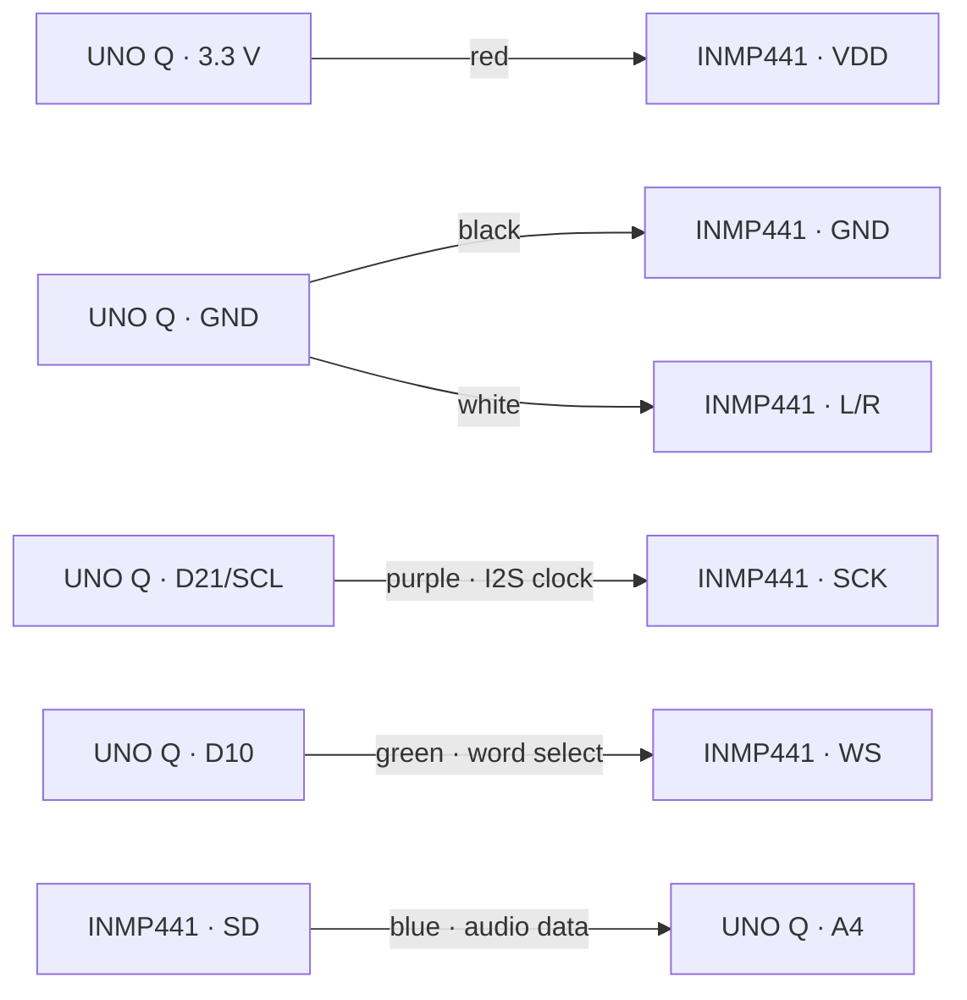

# Hardware: one microphone

Hardware boundary reviewed on September 14, 2026. Recent inference, persistence
and suspend experiments did not add a second microphone, camera, servo or battery.

Current assembly: Arduino UNO Q and one INMP441 I2S MEMS microphone.

For the complete device/lab/software BOM and the beginner build sequence, see
[project documentation](PROJECT_DOCUMENTATION.md#complete-bill-of-materials).
For the complete current set of electrical and logical diagrams, see
[Sylva EchoLens schematics](SCHEMATICS.md).

| Wire color | Microphone pin | UNO Q header | STM32 function |
|---|---|---|---|
| Purple | SCK | D21 / SCL | PB10 / SAI1_SCK_A |
| Green | WS | D10 | PB9 / SAI1_FS_A |
| Blue | SD | A4 | PC1 / SAI1_SD_A |
| Red | VDD | 3.3 V | Supply |
| Black | GND | GND | Reference |
| White | L/R | GND | Select left slot |

SCL is the header label; this application uses its alternate SAI clock function,
not I2C. A4 carries digital I2S data, not an analog microphone voltage.

I2S uses two 32-bit slots per frame, but only the left slot contains the one
microphone signal. The right slot is not a second microphone. Do not infer
direction or stereo recording from the frame format.

This describes the current milestone, not a permanent ceiling. A future localization
stage can add genuinely synchronized microphone hardware, then validate channel
alignment, geometry and angular error before any direction result is used. The
present work prioritizes a trustworthy mono evidence path first.

## Planned autonomous enclosure

The field-hardware direction adds a photovoltaic panel, protected rechargeable
battery, charge controller and regulated supply after whole-board energy has been
measured. No panel wattage, battery capacity or autonomy is selected yet.

Electronics are planned inside a weather-resistant enclosure. The microphone port
will face downward and use a purpose-made hydrophobic acoustic membrane plus a
replaceable open-cell foam windscreen so sound can enter while direct droplets, wind
and debris are reduced. Foam is not treated as waterproofing by itself. Spray,
drainage, condensation, temperature and before/after acoustic-response tests are
required before assigning an ingress rating or deploying unattended.

The conceptual arrangement is shown in [Sylva EchoLens schematics](SCHEMATICS.md#6-planned-field-power-and-enclosure--not-yet-implemented).

## Connection diagram

Disconnect USB power before changing wiring. The INMP441 VDD connection is 3.3 V.

This net diagram documents the verified logical connections. For publication-quality
schematics, reproduce the same six nets in Fritzing and include a physical photograph
that makes both connector ends and the microphone silkscreen visible. The photograph
is important because a generic breakout drawing cannot establish the orientation of
the actual module.

## Sources

- [Arduino UNO Q full pinout](https://docs.arduino.cc/resources/pinouts/ABX00162-full-pinout.pdf)
- [INMP441 datasheet](https://invensense.tdk.com/wp-content/uploads/2015/02/INMP441.pdf)
- [STM32U585 datasheet](https://www.st.com/resource/en/datasheet/stm32u585zi.pdf)

## Documentation assets still to capture

Take a top-down image showing both ends of all six colored wires and a close-up
of the microphone silkscreen. Annotate it with the table above and use photographs
of this exact assembly.
