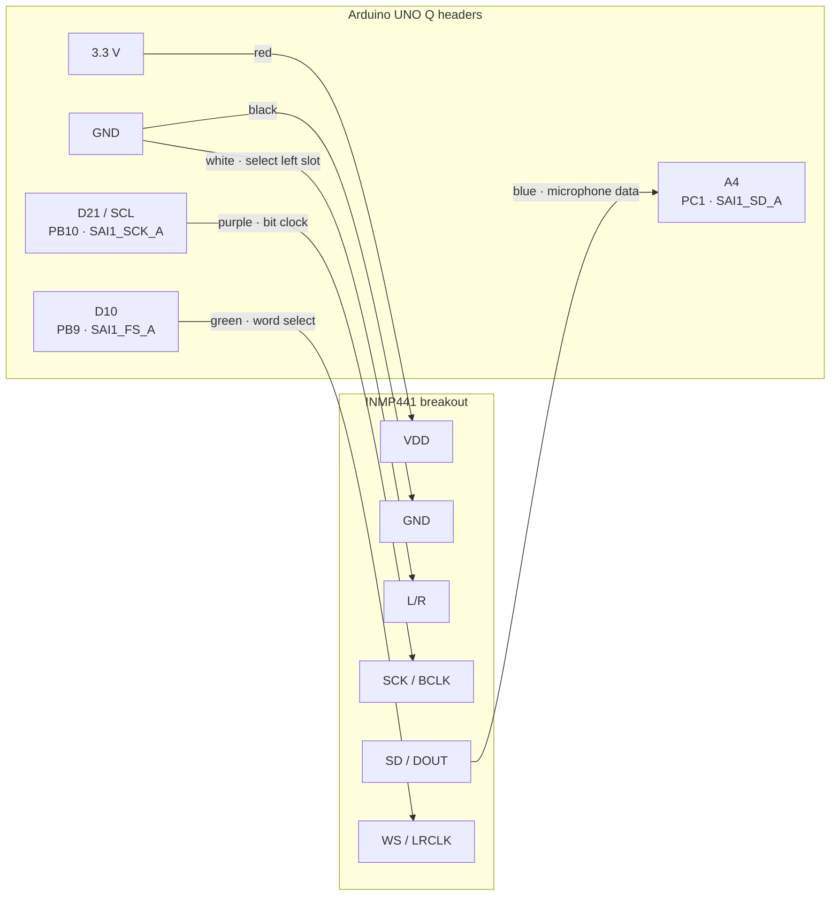

# Project documentation: build Sylva EchoLens

This page is the beginner-oriented path through the project. It explains what the
prototype does, what to obtain, how to wire it, how to reproduce the software, and
which evidence is still required for a complete project publication. Detailed
engineering notes remain linked where they are useful.

## The story

Wildlife monitoring often happens where connectivity is unreliable. Sylva EchoLens
turns an Arduino UNO Q into an acoustic observer: one INMP441 microphone continuously
feeds the STM32 microcontroller, a lightweight adaptive gate keeps sounds that stand
out from the recent background, and the Linux side verifies and stores each event.
BirdNET v2.4 then produces ranked species candidates locally.

The creative step is not simply running a classifier. The system preserves the
sound before the trigger, carries the same signed samples across the two processors,
checks every event, and stores the prediction together with its provenance. Weak
predictions remain explicitly `unknown`. This makes the prototype an auditable field
instrument rather than a black-box label generator.

The current prototype has one microphone, no camera and no servo. It cannot estimate
direction. Recognition-only storage and bounded retention are host-tested and passed
an isolated UNO Q smoke test; controlled power-cut and endurance tests remain.
Extended battery autonomy remains an unmeasured target.

## What the demonstrated prototype does

1. Captures mono audio at a configured 16 kHz through a custom I2S/SAI loader.
2. Calibrates to the startup background and detects an increase in acoustic energy.
3. Saves a fixed 2.048-second event, including 0.512 seconds before confirmation.
4. Verifies event geometry and CRC, then persists an evidence JSON record and a
   WAV while the configured audio budget permits.
5. Runs BirdNET v2.4 on the UNO Q Linux processor without requiring a network after
   dependencies and model assets have been provisioned.
6. Reports `unknown` below the configured 0.25 acceptance threshold while retaining
   the five ranked candidates for inspection.

The capture and inference path has run on the physical board. Recognition quality is
not yet established because the required labeled playback and negative-control set
has not been completed. See [validation](VALIDATION.md) for exact evidence and limits.

## Complete bill of materials

Quantities describe one current acoustic-only prototype. “Required to reproduce”
separates the device itself from lab and documentation equipment.

| Qty | Item | Purpose | Required to reproduce | Notes |
|---:|---|---|:---:|---|
| 1 | Arduino UNO Q | STM32 acquisition plus Linux inference and storage | Yes | Current target board |
| 1 | INMP441 I2S MEMS microphone breakout | Digital mono audio input | Yes | Operate at 3.3 V; breakout pin labels must be visible before wiring |
| 6 | Female-to-male Dupont jumper wires | SCK, WS, SD, VDD, GND and L/R connections | Yes | Current build uses purple, green, blue, red, black and white respectively |
| 1 | USB-C data cable | Board power, upload and ADB/App Lab connection | Yes | Must support data, not charge only |
| 1 | Windows development computer | Build, test, deploy and collect evidence | Yes | The documented workstation also uses WSL for the portable C++ test |
| 1 | Small speaker or second device | Repeatable labeled audio playback | For validation | Keep distance and playback level fixed and record both |
| 1 | Ruler or tape measure | Records microphone-to-speaker distance | For validation | Needed for repeatable comparison |
| 1 | Phone or camera | Wiring photographs and demonstration video | For publication | Not part of the deployed observer |
| 1 | Stable 3.3 V-compatible breadboard arrangement or strain relief | Prevents intermittent jumper movement | Recommended | Do not add a level shifter unless the actual breakout requires one |

No camera, servos, second microphone, battery or solar panel belongs to the current
verified BOM. Add those only when an implemented variant is built and measured.

### Software and tools

| Software/tool | Role | Version or source of truth |
|---|---|---|
| Arduino App Lab | Hosts and manages the UNO Q application | Installed workstation release |
| Bundled `arduino-cli` | Compiles and uploads the STM32 sketch | Path documented in the [runbook](RUNBOOK.md) |
| Custom ArduinoCore-zephyr loader | Enables the verified SAI1/I2S acquisition path | ArduinoCore-zephyr 0.90.0 / Zephyr 4.2; hash in the runbook |
| PowerShell | Runs the guarded build and deployment helpers | Windows host |
| ADB and `arduino-app-cli` | Deploy and inspect the Linux application | Bundled Arduino tooling |
| Python | Receiver, WAV/JSON persistence, audit and inference | Board environment verified with Python 3.13.14 |
| BirdNET and LiteRT | Local acoustic classification | `birdnet==1.1.1`, BirdNET v2.4 FP32, `ai-edge-litert==2.2.0` |
| Git | Source provenance and change inspection | Any current compatible client |
| Python `unittest` | Host-side protocol and inference-adapter tests | Standard library |
| C++17 compiler | Portable MCU algorithm tests | GCC 13/WSL used for the recorded result |

The complete pinned Python dependency set is in
[`app_audio_test/python/requirements.txt`](../app_audio_test/python/requirements.txt).
BirdNET model licensing and its verified hash are recorded in the
[model card](BIRDNET_MODEL_CARD.md).

## Circuit schematic and physical wiring

The microphone is powered only from 3.3 V. Disconnect USB power before changing
wires. Confirm the labels printed on the actual breakout because board layouts vary.



| INMP441 pin | UNO Q header | Wire in tested assembly | Meaning |
|---|---|---|---|
| VDD | 3.3 V | Red | Microphone supply |
| GND | GND | Black | Electrical reference |
| SCK | D21 / SCL | Purple | I2S bit clock through PB10/SAI1_SCK_A |
| WS | D10 | Green | I2S word-select through PB9/SAI1_FS_A |
| SD | A4 | Blue | I2S data into PC1/SAI1_SD_A |
| L/R | GND | White | Places the microphone in the left I2S slot |

`SCL` is only the printed header label in this build; the pin is using its alternate
SAI clock function, not the I2C protocol. Likewise, A4 carries digital I2S data, not
an analog microphone voltage. Two I2S slots do not represent two microphones.

For the final publication, place an annotated top-down wiring photograph immediately
after this diagram. It must show both ends of all six wires, UNO Q pin labels, the
INMP441 silkscreen and the L/R-to-GND connection. A second close-up should make the
microphone pin names readable. Use photographs of this exact assembly.

## Recreate the project

### 1. Obtain the source and confirm its identity

Clone `https://github.com/AM275-pilot/SylvaEchoLens.git`, enter the repository, and
check the remote before deploying:

```powershell
git remote -v
git status --short
```

The active implementation is `app_audio_test/`; its old directory name is retained
for compatibility with the deployed App Lab application.

### 2. Wire one microphone

With USB power disconnected, make the six connections in the schematic. Inspect
them twice, especially VDD/GND and L/R/GND, before reconnecting the board. Keep wires
short and fixed during a measurement so movement is not mistaken for an acoustic
effect.

### 3. Preserve the custom loader and rollback state

This sketch depends on a verified custom I2S loader. A stock-core deployment can
replace it and break capture. Read the [build, deploy and recovery runbook](RUNBOOK.md)
before any upload. Confirm the loader SHA-256 and preserve the installed application
and matching sketch; use only the guarded workflows in this repository.

### 4. Run host tests

```powershell
python -m unittest discover -s tests -p "test_*.py" -v
```

The portable C++17 gate/buffer test is documented in [validation](VALIDATION.md).
A passing host test proves algorithms and protocol handling, not microphone quality
or species accuracy.

### 5. Build, deploy and start listening

Use the guarded scripts exactly as described in the runbook. Pass the location of
the verified custom toolchain rather than encoding a workstation-specific path:

```powershell
$toolchain = 'C:/path/to/verified-custom-toolchain'
./scripts/build-audio-gate.ps1 -ToolchainRoot $toolchain
./scripts/deploy-audio-app.ps1 -WhatIf
```

`-WhatIf` checks the deployment target without changing the board. Only after the
rollback, loader, port and app have been verified should the operator run the actual
Linux deployment and upload commands from the runbook.

After restart, leave the acoustic environment representative and undisturbed for
about five seconds while the gate moves through `settling`, `calibrating` and
`listening`.

### 6. Trigger and inspect one event

Play a labeled sound from a fixed distance. Record its source, expected species,
distance and playback setting. Inspect the App Lab logs for a saved event, then keep
the matching `.wav` and `.json` locally. Run:

```powershell
python scripts/audit-events.py <path-to-event-directory>
```

Listen to the WAV and inspect its generated SVG waveform card. Confirm 16 kHz mono,
32,768 samples, 8,192 pre-event samples, matching CRC/SHA, no missing chunks, and a
BirdNET decision or explicit inference error. A nonzero WAV alone is not proof that
the audio is faithful or that the species was recognized.

### 7. Repeat with controls

Use at least one labeled bird-call replay, quiet/background, and human speech. Repeat
the labeled replay at three documented levels or distances. Keep all outcomes,
including `unknown`, false triggers and failures. Run the ten-minute stability check
and the disconnected inference test from [validation](VALIDATION.md) before claiming
those properties.

## How the code is divided

| Path | Contribution |
|---|---|
| `app_audio_test/sketch/audio_capture.cpp` | Configures SAI1/DMA and extracts the one active microphone slot |
| `app_audio_test/sketch/acoustic_gate.h` | Implements DC-removed energy, calibration, hysteresis and rearming |
| `app_audio_test/sketch/event_buffer.h` | Preserves rolling pre-event history and freezes one exact event |
| `app_audio_test/sketch/sketch.ino` | Schedules acquisition, telemetry, LED level and Bridge transfer |
| `app_audio_test/python/event_receiver.py` | Reassembles chunks and validates geometry and CRC |
| `app_audio_test/python/classification.py` | Runs pinned BirdNET v2.4 inference and applies the explicit unknown policy |
| `app_audio_test/python/offline_store.py` | Applies quotas and retention, publishes evidence and reconciles interrupted writes |
| `app_audio_test/python/power_manager.py` | Coordinates idle detection, MCU wake arming and fail-safe Linux suspend requests |
| `app_audio_test/python/main.py` | Connects App Lab callbacks to bounded persistence and inference workers |
| `scripts/linux/` | Installs the restricted host helper and systemd units for suspend-to-idle |
| `scripts/audit-events.py` | Independently audits files and generates waveform evidence cards |
| `scripts/estimate-autonomy.py` | Calculates an autonomy estimate only from measured power inputs |
| `tests/` | Reproduces protocol, gate, buffer and classification-adapter checks on the host |

Comments in the active code explain hardware constraints, ownership and failure
behavior. The [architecture guide](ARCHITECTURE.md) follows an audio sample from the
microphone to its evidence record and is the best next reading for contributors.

## Publication evidence plan

The repository does not currently contain publishable wiring photos, screenshots or
a demonstration video. Add only real captures from the final matched build.

| Order | Evidence to capture | What it proves | Suggested caption |
|---:|---|---|---|
| 1 | Annotated top-down wiring photo | The BOM and six physical connections match the schematic | “One INMP441 connected to the UNO Q; L/R selects the left slot.” |
| 2 | Close-up of microphone silkscreen | Pin identity and breakout orientation | “INMP441 labels used to verify supply, clocks, data and slot select.” |
| 3 | App Lab log screenshot | Calibration, trigger, checked save and local BirdNET result | Include timestamp/session; redact machine-specific secrets if any |
| 4 | WAV waveform evidence card | Pre-event history and fixed event geometry | State that amplitude is automatically scaled and not calibrated |
| 5 | WAV/JSON pair excerpt | CRC, SHA, source geometry, model version and candidates | Show `unknown` honestly when below threshold |
| 6 | Host-test terminal screenshot | Reproducible software checks pass | Include command and complete pass summary |
| 7 | Short demonstration video | The matched system works from stimulus to saved evidence | Use the storyboard below |

Store small publication-ready images under `docs/assets/` with descriptive names and
alt text. Keep raw recordings, large video masters, toolchains, credentials and build
output outside Git; record their SHA-256 and metadata in the lab notebook instead.

### Demonstration video storyboard (about 90 seconds)

1. **Problem and promise (0–10 s):** explain offline wildlife observation and show
   the compact one-board, one-microphone prototype.
2. **Build (10–25 s):** show the annotated wiring and point out the 3.3 V supply,
   three I2S signals and L/R slot selection.
3. **Pipeline (25–40 s):** overlay the architecture diagram and explain pre-event
   capture, integrity checks and local inference in plain language.
4. **Live proof (40–70 s):** show `listening`, play the labeled stimulus, then show
   the saved WAV/JSON and BirdNET decision without cutting away from the run.
5. **Audit (70–82 s):** show the waveform card, checksum and one control result.
6. **Honest close (82–90 s):** distinguish what was device-tested from pending
   species evaluation, power measurement and future direction finding.

Do not imply that a prerecorded playback is a field observation. Put its source,
license, expected label, distance and playback setting on screen or in the caption.

## Rubric map

| Criterion | Where the publication demonstrates it | Remaining action |
|---|---|---|
| Project documentation | This recreation guide, README, runbook, architecture, validation and lab notebook | Insert final screenshots/photos and link the published video |
| Complete BOM | Hardware and software tables above | Record exact UNO Q, breakout and cable purchase links/part numbers if required by the platform |
| Schematics | Circuit diagram and pin table above; detailed electrical notes in [hardware](HARDWARE.md) | Add the two annotated photographs; optionally redraw the same net list in Fritzing |
| Code & contribution | Active module map, source comments, tests and versioned firmware patches | Include repository link and a brief explanation of the most important original modules |
| Creativity | Adaptive pre-trigger capture, cross-processor evidence integrity, local inference and honest unknown policy | Demonstrate these features together in the video instead of presenting only the classifier output |

## Known limits and next steps

- The gate detects acoustic activity, not a species; wind, speech and machinery can
  trigger it.
- One event takes about 13 seconds to transfer and one MCU event slot means close
  triggers can be skipped.
- The 16 kHz capture cannot recover frequencies above 8 kHz. BirdNET resamples and
  pads the 2.048-second event to its 48 kHz, three-second input geometry.
- Device execution is verified, but recognition accuracy, threshold calibration,
  acoustic frequency response and long-run stability still need representative tests.
- Suspend-to-idle remains experimental and disabled. Linux entered `freeze`, but
  acoustic UART wake did not pass device acceptance, so it is not a release feature.
- No battery-life or solar-autonomy claim is supported without whole-board
  measurements across awake idle, suspend, capture, transfer, inference and writes.
- Storage quotas, protected retention, recovery and recognition-only fallback are
  host-tested and have an isolated device smoke test documented in
  [offline operation](OFFLINE_OPERATION.md); controlled power-cut and board endurance
  remain unverified boundaries.
