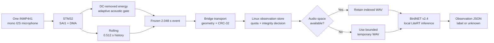
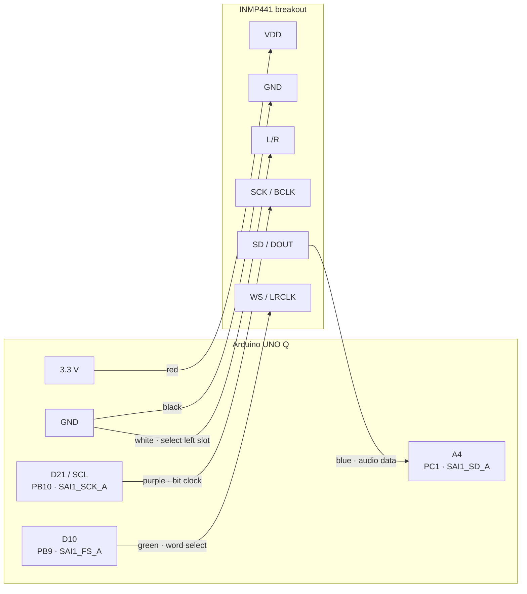
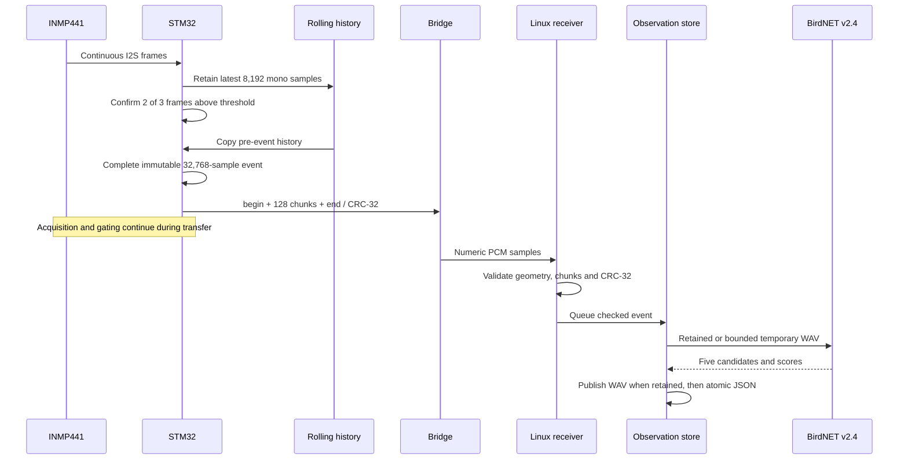
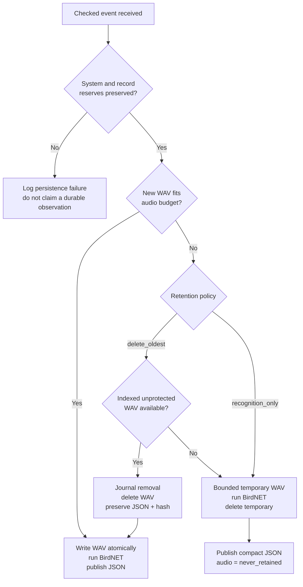
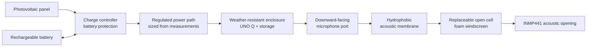

# Sylva EchoLens schematics

This document collects every current circuit and system diagram for the
single-microphone Sylva EchoLens prototype. It is the source set for publication
figures and build reference.

Current hardware boundary: one Arduino UNO Q and one INMP441 microphone. The first
milestone deliberately validates mono capture and evidence before expanding the
sensor geometry. A synchronized second microphone, direction estimation and later
visual orientation are planned development stages, not impossible additions. They
are not wired or claimed in the implemented variant. The repository does not yet
contain a Fritzing project, PCB design, enclosure CAD model or verified schematic
for those future additions.

## 1. System signal path

Publication caption: **One microphone feeds deterministic event selection on the
STM32; Linux verifies the event, runs BirdNET locally and retains an auditable
observation according to the storage policy.**

## 2. Current electrical wiring

Disconnect USB power before changing any connection. Power the INMP441 from 3.3 V,
not 5 V. Header labels describe the physical UNO Q pins; this application uses their
alternate SAI/I2S functions.

### Wiring net list

| Net | INMP441 pin | UNO Q connection | Tested wire | Constraint |
|---|---|---|---|---|
| Microphone supply | VDD | 3.3 V | Red | Do not use 5 V |
| Electrical reference | GND | GND | Black | Common ground |
| I2S bit clock | SCK / BCLK | D21 / SCL · PB10 / SAI1_SCK_A | Purple | Alternate SAI function, not I2C |
| I2S word select | WS / LRCLK | D10 · PB9 / SAI1_FS_A | Green | One word-select signal |
| Microphone data | SD / DOUT | A4 · PC1 / SAI1_SD_A | Blue | Digital input, not analog audio |
| Slot selection | L/R | GND | White | Selects the left I2S slot |

I2S carries two 32-bit slots per frame, but only the selected left slot contains the
one microphone signal. The empty/right slot is not a second channel and cannot be
used for direction finding.

Publication caption: **The implemented prototype uses six connections between one
INMP441 and Arduino UNO Q. L/R is tied to ground, so the microphone occupies the
left I2S slot.**

## 3. Event-window timing

The trigger position stored in metadata is sample 8,192: the start of the
confirmation frame. It is not the first threshold crossing and is not an absolute
UTC timestamp. The gate works on 256-sample, 16 ms frames. DMA delivery and Bridge
transfer mean that frame size is not an end-to-end latency guarantee.

Publication caption: **Every retained event contains 0.512 seconds from before
trigger confirmation and 1.536 seconds from the confirmation frame onward.**

## 4. Cross-processor event sequence

There is one MCU event slot, one in-flight Linux receiver and a persistence queue of
two. A busy MCU slot increments the skipped-event counter; a full Linux queue logs
an explicit drop. There is no retransmission or delivery acknowledgement in the
current protocol.

Publication caption: **The STM32 owns acquisition and event selection. Linux accepts
only complete checked events, then serializes storage and local inference.**

## 5. Offline storage decision

Only final app-owned `event-*.wav` files with readable sidecars are candidates for
automatic removal. Protected WAVs, JSON records, unrelated files, corrupt audio and
unindexed orphan files are never retention candidates.

Publication caption: **Storage pressure changes audio retention, not the truthfulness
of the record: missing audio and every removal reason remain explicit.**

## 6. Planned field power and enclosure — not yet implemented

This is a development intention, not a verified circuit or enclosure. The final
design still requires selection of battery chemistry and capacity, charge-controller
and protection ratings, regulator, connector sealing, panel size, ventilation and
condensation strategy. Foam alone is not a waterproof barrier; the hydrophobic
acoustic membrane, downward-facing geometry, drainage and complete enclosure must be
validated together.

Publication caption: **Planned autonomous field packaging separates the sealed
electronics from a protected acoustic path: solar charging and battery sizing follow
measured power, while the microphone remains audible through a hydrophobic membrane
and replaceable windscreen.**

## Publication and source notes

Mermaid source is kept here so every diagram remains editable. If the publication
editor does not render Mermaid, export each diagram to SVG or a high-resolution PNG
and insert the rendered image with its caption. Do not use a generic two-microphone,
camera or servo diagram for the current prototype.

The electrical diagram is a verified logical net diagram, not a PCB fabrication
schematic. A publication-quality physical record still requires:

1. an evenly lit top-down photograph showing both ends of all six wires;
2. a close-up where the INMP441 silkscreen and orientation are readable;
3. optional reproduction of the same six-net circuit in Fritzing, without adding
   unimplemented components;
4. a revision label tying exported figures to the repository state used for the
   final device demonstration.

Reference documents:

- [Arduino UNO Q full pinout](https://docs.arduino.cc/resources/pinouts/ABX00162-full-pinout.pdf)
- [INMP441 datasheet](https://invensense.tdk.com/wp-content/uploads/2015/02/INMP441.pdf)
- [STM32U585 datasheet](https://www.st.com/resource/en/datasheet/stm32u585zi.pdf)
